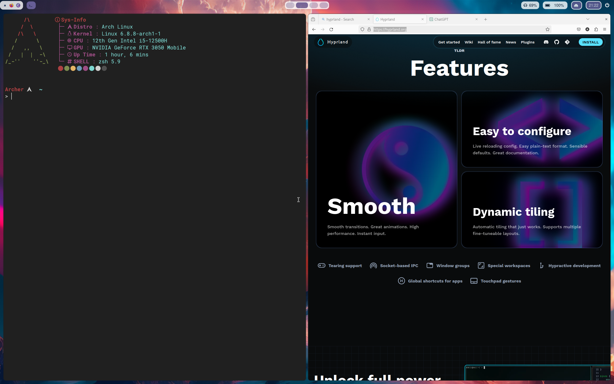

#+TITLE: Hyprland Adventure
#+STARTUP: overview
* 介绍

[[https://hyprland.org/][Hyprland 官网]]
#+ATTR_HTML: :width 1200
[[./Hyprland.png]]

* 安装

=由于本人使用 Archlinux, 下面所有命令均基于 Archlinux=

安装命令如下, 自行加 sudo：
#+begin_src shell
  pacman -S hyprland qt5-wayland xorg-xwayland mesa glfw-wayland kitty wofi mesa
#+end_src

*qt5-wayland* 为 qt5 应用提供 wayland 支持， *xorg-wayland* 为 X11 程序提供wayland支持
*kitty* 是一个强大的终端模拟器，可以实现 tmux 的终端复用，还能不依赖其他插件预览图片，如果在安装完成后无法启动 *kitty* 请安装 GTK3
*wofi* 是一个 APPLauncher 还能够实现dmenu功能，有些东西不明白暂且不管，后面自然就明白了

#+begin_src shell
  pacman -S GTK3
  pacman -S hyprland-git  # 安装最新版的hyprland 可选
#+end_src

安装完上述包之后在终端输入 *Hyprland* 启动 Hyprland. 能够看到上方有个黄色的提示条，牢记。
可以通过修改配置禁止这个黄条条， Hyprland 配置文件在 *~/.config/hypr/hyprland.conf*, 将第一行非注释代码删掉即可，保存后 hyprland 将自动 reload 配置文件。

多按几次 *Super+Q* 试试，你会感受到 Hyprland 的动画之流畅。

* 配置

有机会精读wiki, 这将是你高度自定义的关键  [[https://wiki.hyprland.org][Hyprland Wiki]]

** 基本概念

- Window :: 所谓的 Window 就是你一个应用程序的所占位置
  #+ATTR_HTML: :width 1000
  

  可以看到，上方有两个应用启动，Firefox 和 Kitty, 这就是两个 Window

- Workspace :: 所谓 Workspace 就是你在一个屏幕所看到的，还是上面的图片，你所看到的就是一个 Workspace。在 Hyprland 中，有个特殊的 Workspace 叫做 *Special Workspace* 可以实现应用最小化，之后会详细介绍。
